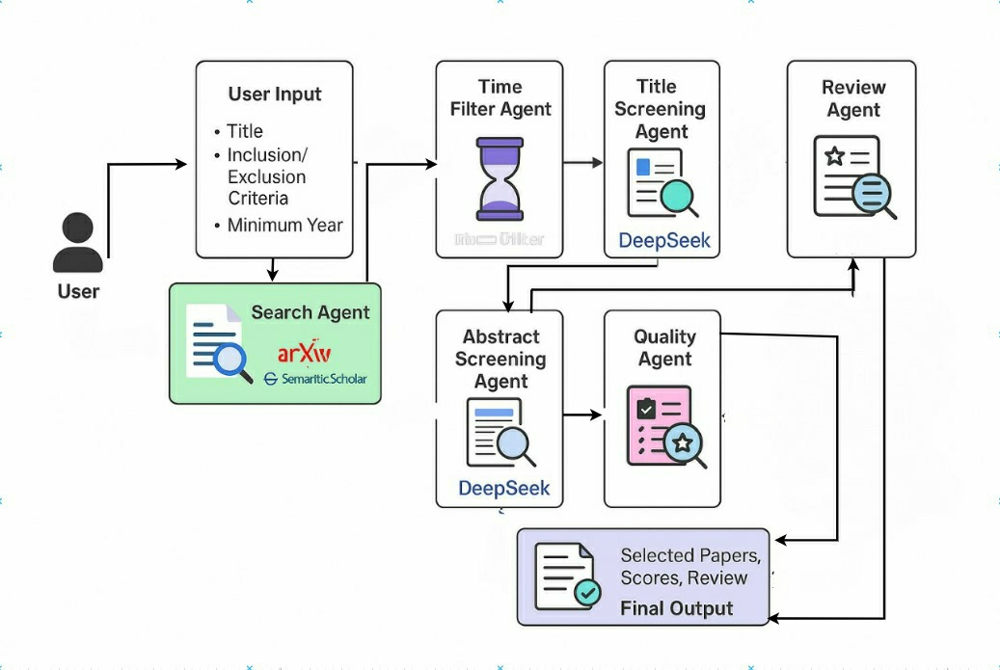

# Systematic Review Screening with Mixture of Agents

This project automates systematic literature reviews using a pipeline of intelligent agents. It uses powerful LLM-based tools to search, screen, and review academic papers based on user-defined criteria.

---

## 🔍 Overview

The pipeline processes user input (title, inclusion/exclusion criteria, and minimum year) and automatically retrieves and filters papers from arXiv and Semantic Scholar. It performs:

- **Search** using query terms
- **Time filtering**
- **Title & abstract screening** using DeepSeek
- **Quality assessment** of selected papers
- **Review summarization**

All of this is done through a seamless agent-based workflow, producing selected papers, scores, and a summarized review.

---

## 🧠 Workflow



---

## ⚙️ Setup Instructions


1. **Clone the repository**

   ```bash
   git clone https://github.com/aswathylofyraj/SR_MOA.git
   ```

2. **Go into the project folder**

   ```bash
   cd SystematicReviewScreening/llm-litreview-agents
   ```

3. **(Optional but recommended) Create a virtual environment**

   ```bash
   python3 -m venv venv
   ```

4. **Activate the virtual environment**

   * **If you're on Windows CMD:**

     ```bash
     venv\Scripts\activate
     ```

   * **If you're on Windows PowerShell:**

     ```bash
     .\venv\Scripts\Activate.ps1
     ```

   * **If you're on macOS/Linux:**

     ```bash
     source venv/bin/activate
     ```

5. **Install the dependencies**

   ```bash
   pip install --upgrade pip
   pip install -r requirements.txt
   ```

6. **Run the app (assuming main file is `main.py`)**

   ```bash
   uvicorn main:app --reload
   ```


📦 Output
The system returns:

1. Filtered and scored research papers

2. AI-generated summary review
